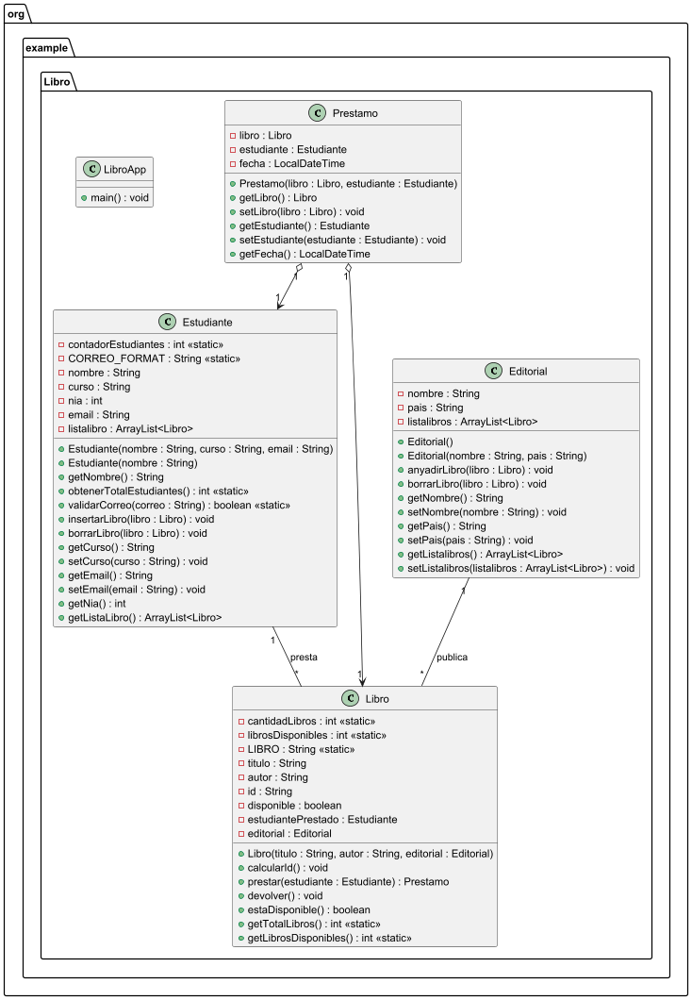

# Practica 1. El Formiguero contra la Rebelion

## Indice
1. [Intro](https://github.com/Rauuhh/Hola/edit/main/Objetos/src/main/java/org/example/Practica1/practica1.md#1-Intro)
2. [Estructura de clases](https://github.com/Rauuhh/Hola/edit/main/Objetos/src/main/java/org/example/Practica1/practica1.md#2-Estructura-de-clases)
3. [Programa Principal](https://github.com/Rauuhh/Hola/edit/main/Objetos/src/main/java/org/example/Practica1/practica1.md#3-Programa-Principal)
4. [Pruebas](https://github.com/Rauuhh/Hola/edit/main/Objetos/src/main/java/org/example/Practica1/practica1.md#4-Pruebas)
5. [Entrega](https://github.com/Rauuhh/Hola/edit/main/Objetos/src/main/java/org/example/Practica1/practica1.md#5-Entrega)

### 1. Intro
> La practica consiste en ver que programa de television tiene mas espectadores
### 2. Estructura de clases
- Diagrama de clases UML

- Codigo de PlantUML
  <code>
  @startuml
package org.example.Libro {

class Editorial {
    - nombre : String
    - pais : String
    - listalibros : ArrayList<Libro>
    + Editorial()
    + Editorial(nombre : String, pais : String)
    + anyadirLibro(libro : Libro) : void
    + borrarLibro(libro : Libro) : void
    + getNombre() : String
    + setNombre(nombre : String) : void
    + getPais() : String
    + setPais(pais : String) : void
    + getListalibros() : ArrayList<Libro>
    + setListalibros(listalibros : ArrayList<Libro>) : void
}

class Estudiante {
    - contadorEstudiantes : int <<static>>
    - CORREO_FORMAT : String <<static>>
    - nombre : String
    - curso : String
    - nia : int
    - email : String
    - listalibro : ArrayList<Libro>
    + Estudiante(nombre : String, curso : String, email : String)
    + Estudiante(nombre : String)
    + getNombre() : String
    + obtenerTotalEstudiantes() : int <<static>>
    + validarCorreo(correo : String) : boolean <<static>>
    + insertarLibro(libro : Libro) : void
    + borrarLibro(libro : Libro) : void
    + getCurso() : String
    + setCurso(curso : String) : void
    + getEmail() : String
    + setEmail(email : String) : void
    + getNia() : int
    + getListaLibro() : ArrayList<Libro>
}

class Libro {
    - cantidadLibros : int <<static>>
    - librosDisponibles : int <<static>>
    - LIBRO : String <<static>>
    - titulo : String
    - autor : String
    - id : String
    - disponible : boolean
    - estudiantePrestado : Estudiante
    - editorial : Editorial
    + Libro(titulo : String, autor : String, editorial : Editorial)
    + calcularId() : void
    + prestar(estudiante : Estudiante) : Prestamo
    + devolver() : void
    + estaDisponible() : boolean
    + getTotalLibros() : int <<static>>
    + getLibrosDisponibles() : int <<static>>
}

class Prestamo {
    - libro : Libro
    - estudiante : Estudiante
    - fecha : LocalDateTime
    + Prestamo(libro : Libro, estudiante : Estudiante)
    + getLibro() : Libro
    + setLibro(libro : Libro) : void
    + getEstudiante() : Estudiante
    + setEstudiante(estudiante : Estudiante) : void
    + getFecha() : LocalDateTime
}

class LibroApp {
    + main() : void
}

Editorial "1" -- "*" Libro : publica
Estudiante "1" -- "*" Libro : presta
Prestamo "1" o--> "1" Libro
Prestamo "1" o--> "1" Estudiante

}
@enduml
</code>
- Contenido de las clases (.java)
### 3. Programa Principal
### 4. Pruebas
### 5. Entrega
